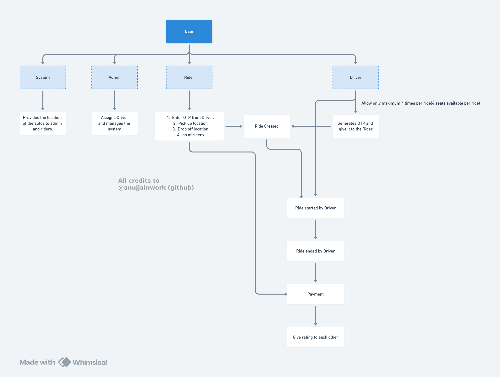
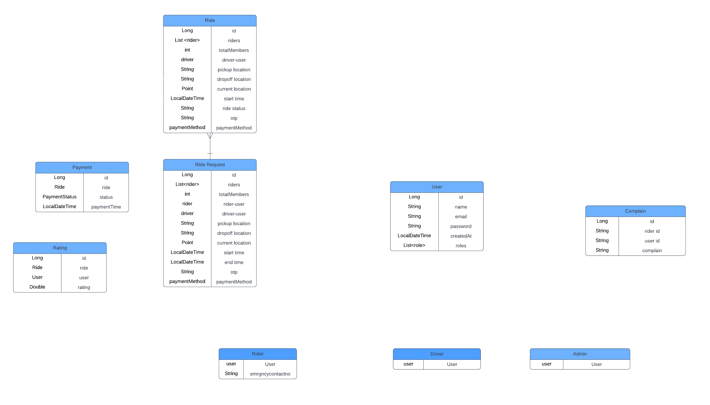

# EzyRide Backend

The **EzyRide Backend** is a **Spring Boot** application powered by **PostgreSQL**, handling taxi availability and ride request management for a seamless transportation solution at **IIIT Nagpur**. This backend serves as the core engine for the [EzyRide mobile application](https://github.com/anujjainwork/EzyRide-frontend), built using Flutter, ensuring real-time updates and smooth communication between the app and backend services.

---

## Features

- **Spring Security** for securing the backend system and database
- **JWT-Based Authentication**: Secure user sessions using JSON Web Tokens.
- **Role-Based Access Control (RBAC)**:
  - Users are assigned roles: **Admin, Rider, Driver**.
  - Access permissions enforced based on roles.
  - Unauthorized users receive **Access Denied** responses.
- **Secure Password Storage**: Passwords are securely hashed before storing.
- **Websocket Connection**: For real time updates
- **MVC**: Built on industry standard architecture.

---
## 📥 Architecture & Database Schema

### Basic Business logic


### Database Schema

---

### Performance & Efficiency
- **Redis Caching**: Implements **Redis** for faster data retrieval, reducing database calls and improving performance.
- **H2 In-Memory Database**: Allows easy local testing without requiring PostgreSQL setup.

### API & Documentation
- **Swagger UI**: Provides an interactive API documentation at:
  ```
  http://localhost:8081/swagger-ui/index.html
  ```
- **Secure Communication**: Uses HTTPS for encrypted data transmission.
- **Customizable Role System**: Easily extendable to accommodate new roles and permissions.

---

## Tech Stack

- **Backend Framework**: Spring Boot (Java 17+)
- **Database**: PostgreSQL & H2 (Development)
- **Authentication**: JWT (JSON Web Tokens)
- **Cache**: Redis
- **Build Tool**: Maven
- **API Documentation**: Swagger

---

## Getting Started

### Prerequisites
Ensure you have the following installed:
- **Java 17+**
- **Maven**
- **Git**
- **PostgreSQL** (Optional for production setup)
- **IDE (IntelliJ IDEA, Eclipse, or VS Code)** (Optional)

### 📥 Installation & Setup

#### 1️⃣ Clone the Repository
```sh
git clone https://github.com/your-username/ezyride-backend.git
cd ezyride-backend
```

#### 2️⃣ Build the Project
```sh
mvn clean install
```

#### 3️⃣ Run the Application
```sh
mvn spring-boot:run
```

#### 4️⃣ Access the In-Memory Database
Once the application is running, access the H2 database:
```
http://localhost:8081/h2-console
```
(Replace `8081` with your actual port if different.)

---

## 📖 API Documentation
For a detailed API reference, visit:
```
http://localhost:8081/swagger-ui/index.html
```

---

## Project Presentation
For an in-depth understanding of the project’s architecture, design, and implementation, check out the **detailed presentation**:  
📌 [EzyRide Backend Presentation](https://drive.google.com/drive/folders/1taq1dB9D5cQKqTJ8uMgrbP0FAgVGgGdM)

### 📧 Contact
For any inquiries or discussions, feel free to reach out:
📩 **jainanuj.work@gmail.com** | 🐙 **GitHub: [anujjainwork](https://github.com/anujjainwork)**

